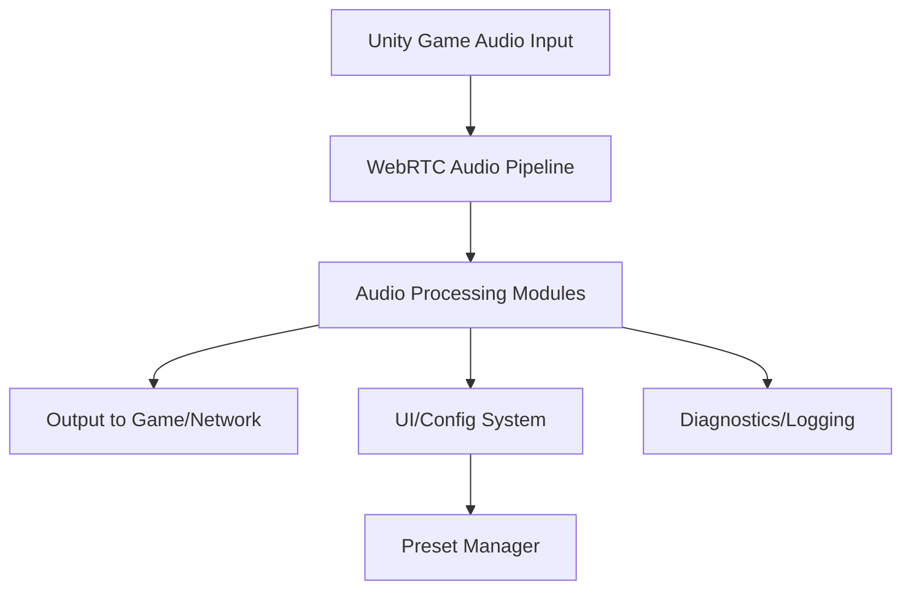
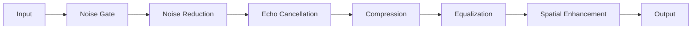

# LethalMic Technical Overview

> ⚠️ **UNDER DEVELOPMENT - NOT READY FOR USE** ⚠️

## Introduction
LethalMic is a modular, high-performance audio processing plugin for Lethal Company, designed to deliver real-time voice enhancement, noise reduction, and advanced audio features using a modern .NET and Unity-based stack. This document provides a deep technical reference for developers and advanced users.

---

## Architecture

### High-Level System Diagram


### Core Components
- **Audio Processing Pipeline**: Modular, multi-stage pipeline using WebRTC, custom DSP, and Unity audio hooks.
- **Input System Integration**: Uses InputUtils for robust, rebindable keybinds and UI toggles.
- **Preset & Config System**: JSON-based, supports runtime and file-based configuration.
- **UI Layer**: Unity UI Toolkit, modular components for settings, status, and visualization.
- **Performance Layer**: Threaded processing, SIMD optimizations, and memory pooling.

---

## Dependency Overview

- **BepInExPack**: Core plugin loader for Lethal Company mods.
- **Rune580-LethalCompany_InputUtils**: Modern input/keybind API for Unity mods.
- **UnityEngine & Modules**: Audio, UI, and input system integration.
- **Harmony**: Runtime patching for non-invasive game integration.
- **SIPSorcery**: WebRTC audio stack for real-time DSP.
- **Custom DLLs**: DissonanceVoip, Opus, RNNoiseSharp, etc. for advanced audio features.

---

## Project Structure

```
LethalMic/
├── Core/
│   ├── LethalMic.cs              # Main plugin entry
│   ├── LethalMicStatic.cs        # Static helpers/utilities
│   └── PluginInfo.cs             # Metadata
├── Audio/
│   ├── Processors/               # Modular DSP components (Noise, Echo, Compression)
│   ├── Presets/                  # Preset definitions and management
│   └── Utils/                    # Audio math, FFT, buffers
├── UI/
│   ├── Components/               # UI Toolkit components
│   ├── Styles/                   # USS style sheets
│   └── Resources/                # UXML layouts
├── Patches/                      # Harmony patches for game hooks
├── Utils/                        # General utilities (performance, logging)
├── Resources/                    # Embedded assets
```

---

## Audio Processing Pipeline

### Modular Stages
- **Noise Gate**: VAD, thresholding, attack/release
- **Noise Reduction**: FFT-based spectral subtraction, RNNoise integration
- **Echo Cancellation**: Cross-correlation, adaptive suppression
- **Dynamic Range Compression**: Attack/release, ratio, threshold
- **Equalization**: Parametric, adaptive, voice-focused
- **Spatial Enhancement**: 3D panning, HRTF (planned)
- **Loop Detection**: Feedback loop prevention, windowed correlation

### Example Pipeline Flow


---

## Configuration & Presets
- **Config File**: `BepInEx/config/com.xenoveni.lethalmic.cfg` (JSON)
- **Runtime UI**: All settings adjustable in-game
- **Presets**: Save/load, auto-apply, environment-aware
- **Validation**: Input validation, range checks, error fallback

---

## Performance & Optimization
- **Threading**: Uses .NET threads for audio processing off main thread
- **SIMD**: Vectorized math for FFT, filtering, and DSP
- **Memory Pooling**: Reduces GC pressure for real-time audio
- **Unity Integration**: Minimal main-thread work, async UI updates

---

## Input & UI System
- **InputUtils**: All keybinds and UI toggles are rebindable
- **UI Toolkit**: Modular, themeable, supports runtime updates
- **Status/Diagnostics**: Real-time stats, error display, debug logging

---

## Build & Development
- **.NET SDK 6.0+**: Modern C# features, cross-platform
- **Unity 2022.3.9+**: UI and audio integration
- **BepInEx 5.4.x**: Plugin loader
- **Build Script**: `build.ps1` for packaging and deployment
- **Unit Tests**: (Planned) for DSP and config logic

---

## Extensibility
- **Processors**: Add new DSP modules by implementing IAudioProcessor
- **Presets**: Extendable via JSON or UI
- **UI**: Add new panels/components via UI Toolkit
- **Localization**: (Planned) for multi-language support

---

## Advanced Topics
- **WebRTC Integration**: Custom pipeline for low-latency, high-quality voice
- **Opus/RNNoise**: Optional codecs for further enhancement
- **Harmony Patching**: Safe, non-destructive game hooks
- **Diagnostics**: Logging, error boundaries, and performance counters

---

## Contributors & License
- See [LICENSE](../../LICENSE)
- Main author: xenoveni
- Contributions welcome via PR 